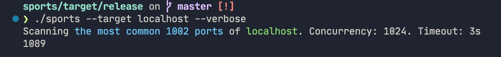
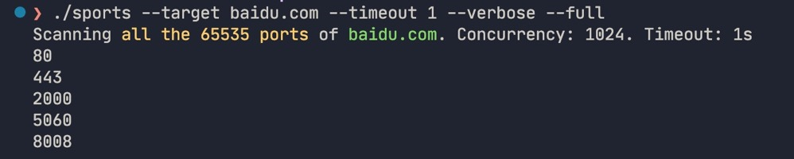

# sports

A list of ports to scan, fast、smart、safe.

# usage

### install

```
cargo install sports
```

### help
```
Usage: sports [OPTIONS] --target <TARGET>

Options:
      --target <TARGET>            The target to scan
  -c, --concurrency <CONCURRENCY>  Number of concurrency to scan [default: 1024]
  -f, --full                       Scan all 65535 ports [default: false]
  -t, --timeout <TIMEOUT>          Seconds of connection timeout [default: 3]
  -v, --verbose                    Display detailed information [default: false]
  -h, --help                       Print help
  -V, --version                    Print version
```

# scan generic port



# scan all port


